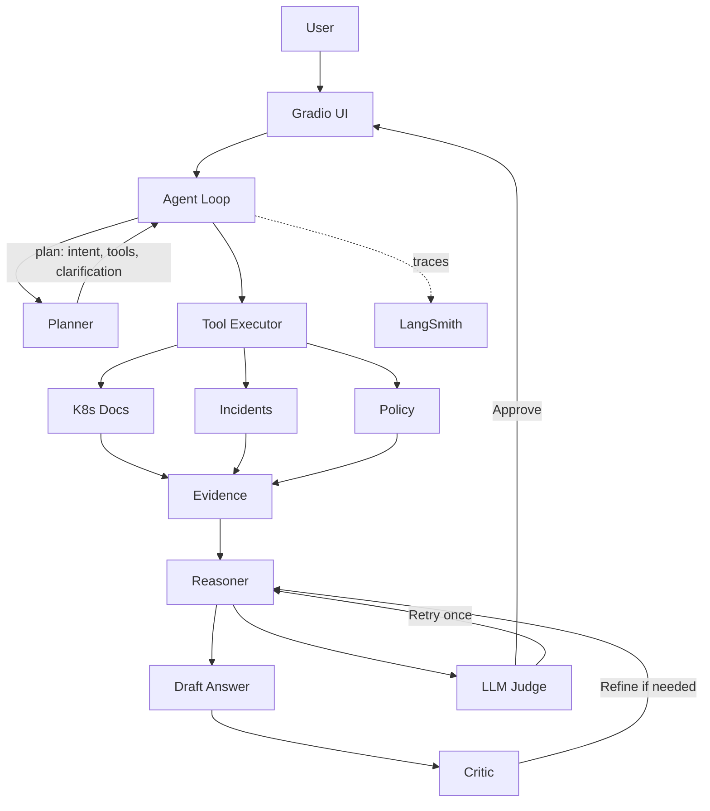
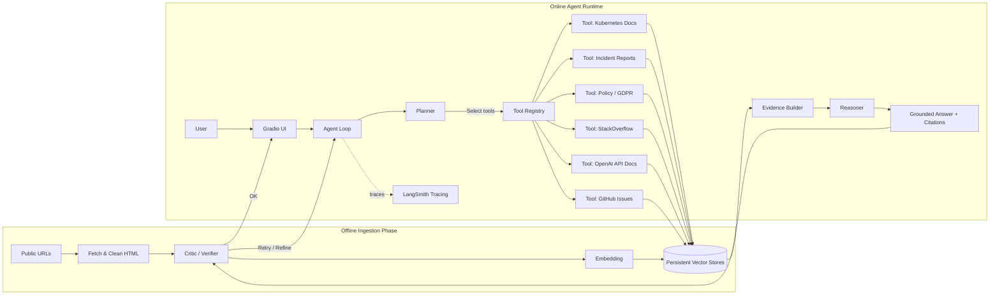

# Agentic RAG – Enterprise Knowledge Analyst

## Overview

This project implements an **Agentic Retrieval-Augmented Generation (RAG)** system that behaves like an **Enterprise Knowledge Analyst**.

Unlike a traditional static RAG pipeline, this system:

* Understands user intent
* Plans retrieval steps
* Dynamically selects knowledge sources via tools
* Retrieves and synthesizes grounded evidence
* Performs **multi-stage answer verification**
* Produces **auditable, traceable answers**

The system is designed to be **auditable, extensible, and enterprise-ready**.

---

## Key Objectives

* Build a **true agent loop**, not a static RAG chain
* Use **multiple heterogeneous knowledge sources**
* Enable **dynamic retrieval decisions** without `if/else` routing
* Ensure **grounded, citation-based answers**
* Add **verification, critique, and self-correction**
* Provide **observability and explainability**
* Offer a **user-friendly UI** for testing

---

## High-Level Architecture

### Two distinct phases

```
OFFLINE PHASE (Ingestion)           ONLINE PHASE (Agent Runtime)
---------------------------         -----------------------------
Fetch documents                     User asks a question
Clean & chunk text                  Planner interprets intent
Embed & store vectors   ───────▶    Tools retrieve evidence
Persist vector stores               Reasoner synthesizes answer
                                    Critic checks logic
                                    Judge evaluates quality
                                    Auto-retry if needed
```

---

# Architecture Diagram

## System Architecture Overview

The system is intentionally split into **two clearly separated phases**:

1. **Offline Ingestion Phase** – Data preparation and vectorization
2. **Online Agent Runtime Phase** – Dynamic reasoning, retrieval, and verification

This separation ensures determinism, scalability, and enterprise-grade reliability.

---

## 1. Original Agentic RAG Architecture (Conceptual Core)

This conceptual architecture **remains valid** and continues to guide the implementation.



---

## 2. Final Architecture (Full System View)

The final system **extends** the original design with:

* Offline ingestion
* Persistent vector stores
* Capability-based tools
* Tool registry
* Multi-layer answer verification
* Controlled auto-retry


---

## 3. Updated Agent Runtime Flow (IMPORTANT)

### **Final Agent Execution Order**

1. **Planner**

   * Determines intent
   * Selects tools
   * Decides if clarification is required

2. **Clarification (Early Exit)**

   * If `need_clarification = true`, agent returns a clarification question
   * No retrieval or reasoning occurs

3. **Retrieval**

   * Tools retrieve documents from vector stores
   * Evidence is deduplicated and formatted

4. **Reasoner**

   * Generates a grounded answer using evidence only

5. **Critic (Lightweight Logical Check)**

   * Checks logical consistency and alignment
   * Does **not** score or approve
   * Can request **one refinement pass**

6. **Judge (LLM-as-Evaluator)**

   * Scores answer on grounding and completeness
   * Issues verdict: `approve` or `needs_review`

7. **Auto-Retry (Controlled)**

   * If judge returns `needs_review`
   * Agent retries **once**
   * Retry must improve judge score to be accepted

8. **Final Answer Returned**

   * With citations
   * With full trace

---

## 4. Updated Agent Components

### **Agent Runtime Components**

| Component        | Responsibility                                  |
| ---------------- | ----------------------------------------------- |
| Planner          | Intent detection, tool selection, clarification |
| Tools            | Retrieve documents from vector stores           |
| Evidence Builder | Deduplicate and format retrieved content        |
| Reasoner         | Generate grounded answers                       |
| Critic           | Logical consistency & reasoning gaps            |
| Judge            | Quality, grounding & completeness evaluation    |
| Auto-Retry       | One controlled self-correction loop             |
| UI               | Display answer and trace                        |

### Core principle 

**Ingestion is completely decoupled from runtime.**  
The agent **never fetches or embeds documents during question answering**.  
All document ingestion, chunking, and embedding happens **offline** and is persisted in vector stores.

---

## Project Structure

agentic-rag-knowledge-analyst/
│
├── prompts/                    # All LLM prompts (externalized)
│   ├── planner.txt
│   ├── reasoner.txt
│   └── critic.txt
│
├── data/                       # Curated source URLs
│   ├── urls_k8s.txt
│   ├── urls_incidents.txt
│   ├── urls_policy.txt
│   ├── urls_stackoverflow.txt
│   ├── urls_openai_api.txt
│   └── urls_github_issues.txt
│
├── vectorstores/               # Persistent Chroma vector stores
│
├── app/
│   ├── config.py               # Environment & configuration
│   ├── llms.py                 # LLM initialization
│   ├── chunking.py             # Text chunking strategy
│   ├── ingestion.py            # Offline ingestion logic
│   │
│   ├── tools/                  # Capability-based tools
│   │   ├── registry.py
│   │   ├── retrieval_tools.py
│   │   └── evidence.py
│   │
│   ├── agent/                  # Agent intelligence
│   │   ├── planner.py
│   │   ├── reasoner.py
│   │   ├── critic.py
│   │   └── agent_loop.py
│   │
│   └── ui/
│       └── gradio_app.py       # User interface
│
├── scripts/
│   └── ingest_all.py           # Offline ingestion runner
│
├── tests/                      # Unit tests
│
├── run.py                      # Application entry point
└── requirements.txt

---

## Key Design Highlights

- **Offline ingestion only**  
  All documents are ingested, chunked, embedded, and stored ahead of time.

- **Runtime is retrieval-only**  
  The agent retrieves from pre-built vector stores and reasons over evidence.

- **Prompt externalization**  
  Planner, reasoner, and critic prompts are fully decoupled from code.

- **Capability-based tooling**  
  Tools are registered and invoked explicitly by the agent planner.

- **Agentic loop architecture**  
  Planner → Reasoner → Critic → Iterate (with evidence grounding).

---

## Entry Points

- **Offline ingestion**
```bash
  python scripts/ingest_all.py
````

## 5. Critic vs Judge

### Critic (Pre-Judge)

* Lightweight
* Logical sanity check
* Detects missing reasoning
* No scoring
* No approval decision

### Judge (Final Evaluator)

* Scores answer quality
* Verifies grounding
* Determines if retry is needed
* Drives auto-retry

> **Critic asks:** “Does this reasoning make sense?”
> **Judge asks:** “Is this answer good enough?”

---

## 6. Trace Contract

The agent always returns:

```json
{
  "question": "...",
  "plan": {
    "intent": "...",
    "tools": [...],
    "need_clarification": false,
    "clarification_question": null
  },
  "evidence_size": 478,
  "critic": { ... },
  "judge": { ... },
  "final_state": "answered"
}
```

Planner decisions live under `trace.plan`.
Tests and UI rely on this **stable contract**.

---

## 7. Evaluation Methodology

### Added: Judge-Driven Evaluation

The system now includes **LLM-as-a-Judge** as part of runtime, not just evaluation.

The judge evaluates:

* Faithfulness to evidence
* Relevance to the question
* Completeness of explanation

### Auto-Retry Policy

* At most **one retry**
* Retry must improve judge score
* Prevents infinite loops
* Keeps costs bounded

---

## 8. Why This Is a True Agentic RAG System

This system is **not**:

* A single-pass RAG chain
* A static retriever + generator
* A prompt-only solution

It **is**:

* Planner-driven
* Tool-oriented
* Multi-stage verified
* Self-correcting
* Auditable via trace
* Deterministic at runtime

---

## Testing Strategy & Test Cases

This project uses **pytest** to validate **agentic behavior and control flow**, rather than brittle LLM text outputs.

The tests focus on **planner decisions, tool selection, clarification handling, verification logic, and trace consistency**.

---

## Testing Philosophy

Because LLM outputs are probabilistic, tests **do not assert exact answer text**.

Instead, they assert:

* Correct planner decisions
* Correct clarification behavior
* Correct tool selection
* Correct agent loop execution
* Stable and auditable trace structure

This ensures the system behaves like a **true agent**, not a static pipeline.

---

## Test Execution

Run all tests from the project root:

```bash
pytest -v
```

---

## Planner Test Cases

### 1. Kubernetes-specific query

**Input**

```
How does Kubernetes RBAC authorize API requests?
```

**Expected behavior**

* `need_clarification = false`
* Kubernetes documentation tool selected
* No clarification question

**Validated by**

```python
test_planner_selects_kubernetes_tool
```

---

### 2. Ambiguous / underspecified query (Clarification required)

**Input**

```
How should this be handled?
```

**Expected behavior**

* `need_clarification = true`
* No tools selected
* A non-empty clarification question returned

**Validated by**

```python
test_planner_requests_clarification_for_ambiguous_query
```

This test enforces the **explicit clarification policy** defined in the planner prompt.

---

### 3. Cross-domain planner decision

**Input**

```
If a cloud outage exposed user data, what GDPR obligations apply?
```

**Expected behavior**

* `need_clarification = false`
* One or more relevant tools selected
* Planner allowed to select multiple sources dynamically

**Validated by**

```python
test_planner_selects_multiple_tools_for_cross_domain_question
```

---

## Agent Loop Test Cases

### 4. End-to-end agent execution

**Input**

```
How does Kubernetes RBAC authorize API requests?
```

**Expected behavior**

* Non-empty, grounded answer
* Agent trace returned
* `trace.plan.need_clarification = false`
* Tools listed under `trace.plan.tools`

**Validated by**

```python
test_agent_loop_returns_answer_and_trace
```

---

### 5. Clarification path execution

**Input**

```
How should this be handled?
```

**Expected behavior**

* Agent asks a clarification question
* No retrieval performed
* Agent trace includes:

  * `trace.final_state = "clarification"`
  * `trace.plan.need_clarification = true`
  * Empty `trace.plan.tools`

**Validated by**

```python
test_agent_loop_clarification_path
```

This confirms clarification is treated as a **first-class outcome**.

---

### 6. Cross-domain agent execution

**Input**

```
If a cloud outage exposed user data, what GDPR obligations apply?
```

**Expected behavior**

* Grounded answer with **clickable citations**
* One or more tools used
* Evidence sourced from policy and compliance knowledge

**Validated by**

```python
test_agent_loop_cross_domain_execution
```

---

## Judge & Verification Test Cases

### 7. Judge approval of grounded answer

**Expected behavior**

* Judge approves answers that are faithful to evidence
* Judge does not request retry when grounding is sufficient

**Validated by**

```python
test_judge_approves_grounded_answer
```

---

## Why These Tests Matter

The test suite ensures:

* The planner does not guess intent for ambiguous queries
* Tool selection is dynamic and capability-driven
* Clarification is enforced when required
* The agent loop is observable and auditable
* Critic and Judge logic integrates correctly
* Auto-retry is bounded and safe

---

## Summary

The test suite validates **how the answer was produced**, not just **what the answer is**.

This guarantees that the system behaves as a **true Agentic RAG system**, rather than a static retrieval pipeline.

---
