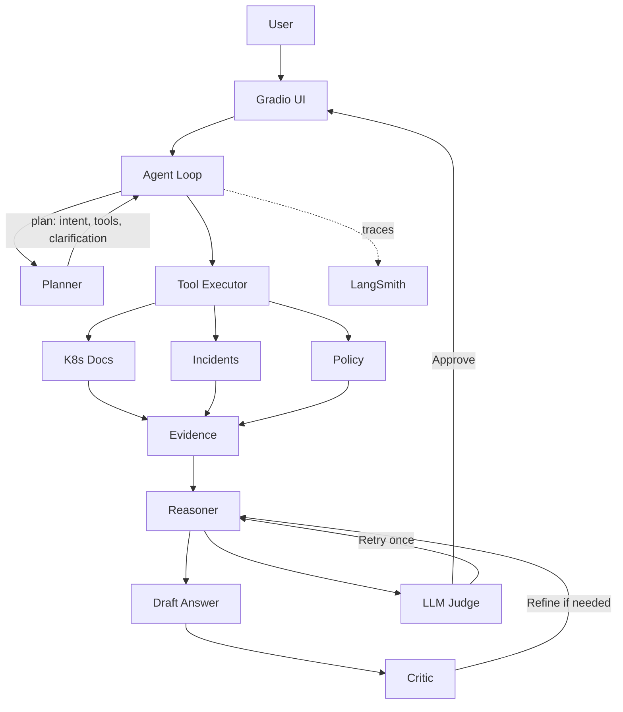
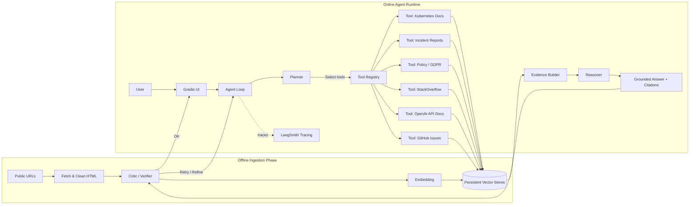

# System Architecture

This document describes the **end-to-end architecture** of the Agentic RAG – Enterprise Knowledge Analyst system.

The system is intentionally split into **two distinct phases**:

1. **Offline Ingestion Phase** – deterministic data preparation
2. **Online Agent Runtime Phase** – dynamic agent reasoning

---
## 1. Original Agentic RAG Architecture (Conceptual Core)

This conceptual architecture **remains valid** and continues to guide the implementation.

---

## 2. Final Architecture (Full System View)

The final system **extends** the original design with:

* Offline ingestion
* Persistent vector stores
* Capability-based tools
* Tool registry
* Multi-layer answer verification
* Controlled auto-retry

