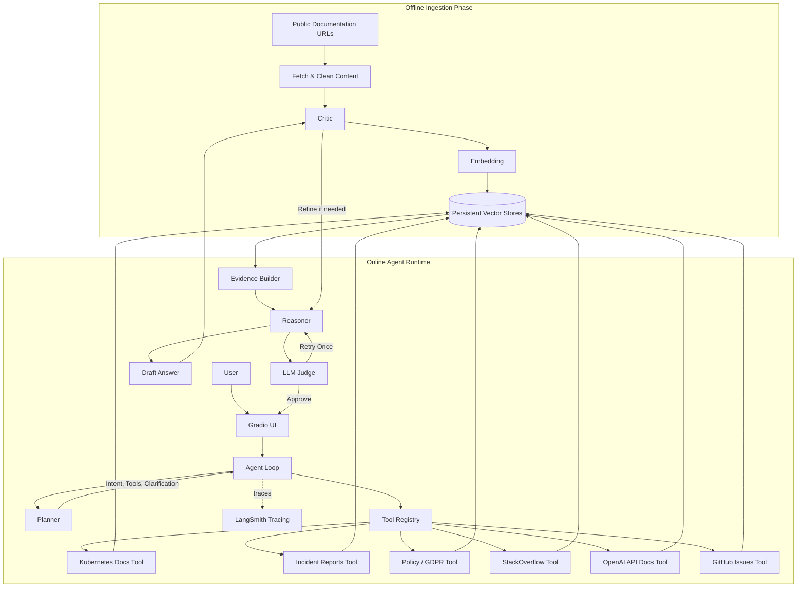

# System Architecture

This document describes the **end-to-end architecture** of the Agentic RAG – Enterprise Knowledge Analyst system.

The system is intentionally split into **two distinct phases**:

1. **Offline Ingestion Phase** – deterministic data preparation
2. **Online Agent Runtime Phase** – dynamic agent reasoning

---

## High-Level Architecture Overview
